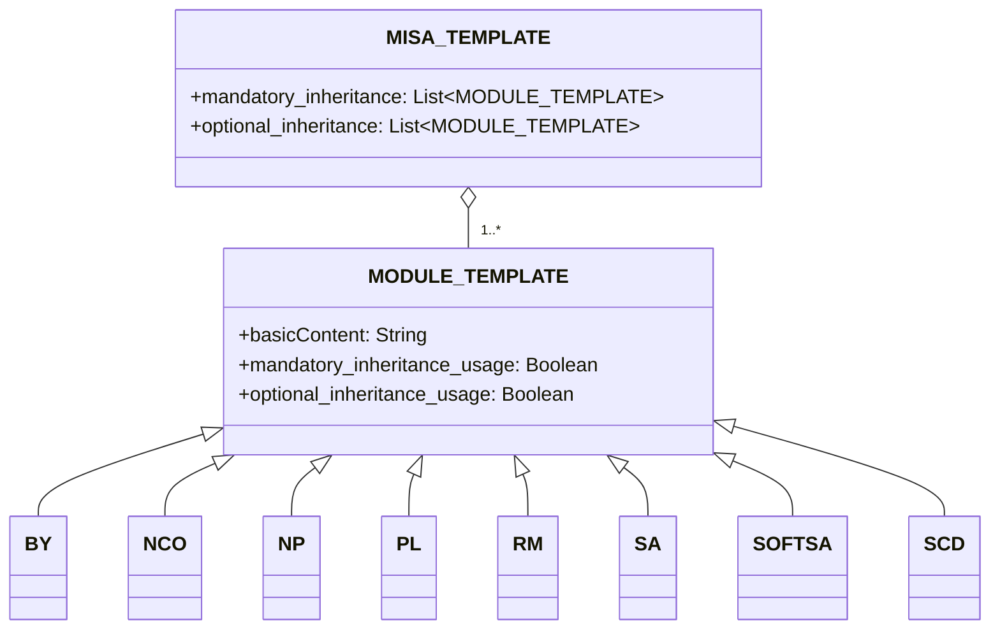

# نبذة
إطار ترخيص Modular and Inclusive Software Advancement (MISA) هو إطار ترخيص يمكن تعديله بسهولة بناءً على متطلباتك. يتم ترخيص الإطار نفسه بموجب أحدث إصدار من ترخيص [MISA-CLASSIC](/MISA-CLASSIC.md).

"MISA-LF"، وهو الإصدار المختصر لاسم هذا المستودع، هو أيضًا متغير مقبول للاسم الأساسي الذي يتبع "التزام استمرارية التسمية" للترخيص.

تم تصميم إطار ترخيص MISA لتوفير نهج مرن وقابل للتعديل للترخيص مفتوح المصدر. من خلال الجمع بين وحدات الترخيص المختلفة، يمكن للمستخدمين إنشاء تراخيص مخصصة تناسب احتياجاتهم وتفضيلاتهم المحددة.

## حول MISA-CLASSIC.md
من المهم ملاحظة أن MISA-CLASSIC مكافئ لـ MISA-NCO، وهو ترخيص يتكون من وحدة التزام استمرارية التسمية (NCO). هذا يعني أنه يمكن اعتبار أي مشروع مرخص بموجب MISA-CLASSIC مرخصًا أيضًا بموجب MISA-NCO.

وضع ترخيص MISA-CLASSIC الأساس لتطوير إطار ترخيص MISA، الذي يوسع مفهوم الترخيص القابل للتعديل من خلال تقديم مجموعة واسعة من الوحدات القابلة للتخصيص التي يمكن دمجها لإنشاء تراخيص مصممة خصيصًا لتلبية احتياجات وتفضيلات محددة.

## نظرة عامة على الإطار
يتكون إطار ترخيص MISA من المكونات التالية:

1. MISA-CLASSIC.md: الترخيص الأساسي الذي يعمل كأساس للإطار.
2. القوالب:
   - MISA-TEMPLATE.md: قالب لإنشاء تراخيص جديدة تستند إلى MISA.
   - MODULE-TEMPLATE.md: قالب لإنشاء وحدات ترخيص جديدة.
3. الوحدات الافتراضية: مجموعة من وحدات الترخيص المحددة مسبقًا التي يمكن استخدامها في التراخيص المستندة إلى MISA.

## هيكل الإطار
يمكن تصور هيكل إطار ترخيص MISA باستخدام مخطط mermaid التالي:

## الوحدات الافتراضية
يأتي إطار ترخيص MISA مع الوحدات الافتراضية التالية:

- [BY.md](/Default%20modules/BY.md): النسب/الائتمان
- [NCO.md](/Default%20modules/NCO.md): التزام استمرارية التسمية
- [NP.md](/Default%20modules/NP.md): غير ربحي/غير تجاري
- [PL.md](/Default%20modules/PL.md): ترخيص براءات الاختراع
- [RM.md](/Default%20modules/RM.md): المعاملة بالمثل/الترخيص المتبادل
- [SA.md](/Default%20modules/SA.md): حقوق النسخ/المشاركة بالمثل
- [SOFTSA.md](/Default%20modules/SOFTSA.md): حقوق النشر / الترخيص بالمثل الناعمة (تستهدف التفرعات فقط)
- [SCD.md](/Default%20modules/SCD.md): الكشف عن الشفرة المصدرية

## استخدام القوالب
### إنشاء ترخيص جديد يستند إلى MISA
لإنشاء ترخيص جديد يستند إلى MISA، اتبع هذه الخطوات:

1. انسخ محتويات [MISA-TEMPLATE.md](/Templates/MISA-TEMPLATE.md) في ملف جديد.
2. قم بتعديل الأقسام والوحدات وفقًا لمتطلباتك.
3. احفظ الملف باسم مناسب، متبعًا اتفاقية التسمية الموضحة في قسم "اتفاقية التسمية".

### إضافة وحدة ترخيص جديدة
لإضافة وحدة ترخيص جديدة، اتبع هذه الخطوات:

1. انسخ محتويات [MODULE-TEMPLATE.md](/Templates/MODULE-TEMPLATE.md) في ملف جديد.
2. املأ المعلومات والشروط اللازمة للوحدة.
3. احفظ الملف باسم مناسب، متبعًا اتفاقية التسمية الموضحة في قسم "اتفاقية التسمية".
4. أضف الوحدة الجديدة إلى القسم المناسب (القسم 2 أو القسم 5) من ترخيصك المستند إلى MISA.

## اتفاقية التسمية
اتفاقية التسمية للتراخيص المستندة إلى MISA هي كما يلي:

MISA-AA/BB/.../XX-aa/bb/.../xx-|xxx|

حيث:
- AA/BB/.../XX تمثل شروط الوراثة الإلزامية، باستخدام الأحرف الكبيرة.
- aa/bb/.../xx تمثل شروط الوراثة الاختيارية، باستخدام الأحرف الصغيرة.
- |xxx| يمثل وصفًا موجزًا للشروط الإضافية غير المشمولة بالوحدات المحددة مسبقًا، محاطًا بأحرف الأنبوب (|).

على سبيل المثال، ترخيص يتكون من الوحدات الافتراضية التالية:
- إلزامي: التزام استمرارية التسمية (NCO)، الكشف عن الشفرة المصدرية (SCD)
- اختياري: النسب/الائتمان (BY)، ترخيص براءات الاختراع (PL)

سيتم تسميته: MISA-NCO/SCD-by/pl

مثال آخر، ترخيص مع:
- إلزامي: حقوق النسخ/المشاركة بالمثل (SA)، غير ربحي/غير تجاري (NP)، المعاملة بالمثل/الترخيص المتبادل (RM)
- شروط إضافية: "ليس للاستخدام العسكري"

سيتم تسميته: MISA-SA/NP/RM-|Not for military use|

بالنسبة لوحدات الترخيص، اتفاقية التسمية هي:

اسم الوحدة (الاختصار)

حيث:
- اسم الوحدة هو الاسم الكامل للوحدة.
- الاختصار هو شكل مختصر لاسم الوحدة، محاط بأقواس.

## ملاحظة حول المصطلحات القانونية

يرجى ملاحظة أن محتوى هذا المستودع، بما في ذلك إطار ترخيص MISA، والوحدات الافتراضية، والقوالب، تم إنشاؤه بشكل أساسي باستخدام نماذج اللغة الكبيرة (LLMs). بينما بذلنا كل جهد لضمان دقة ووضوح المعلومات المقدمة هنا، قد تكون هناك حالات لا تكون فيها المصطلحات القانونية المستخدمة صحيحة أو شاملة بدقة.

نحن نشجع بشدة ونرحب بطلبات السحب من الخبراء القانونيين والأفراد ذوي المعرفة لمساعدتنا في تحسين وتطوير اللغة القانونية المستخدمة في جميع أنحاء هذا المستودع. ستكون مساهماتكم ذات قيمة كبيرة في ضمان أن يكون إطار ترخيص MISA سليمًا من الناحية القانونية ويمكن استخدامه بشكل فعال في سيناريوهات العالم الحقيقي.

إذا لاحظت أي مصطلحات قانونية غير دقيقة، أو صياغة غير واضحة، أو لديك اقتراحات للتحسين، فلا تتردد في تقديم طلب سحب مع التغييرات المقترحة. معًا، يمكننا العمل على جعل إطار ترخيص MISA أداة قوية وموثوقة لمجتمع المصدر المفتوح.

شكرًا لك على تفهمك ودعمك في هذا الجهد التعاوني لإنشاء إطار ترخيص قابل للتعديل دقيق وشامل من الناحية القانونية.