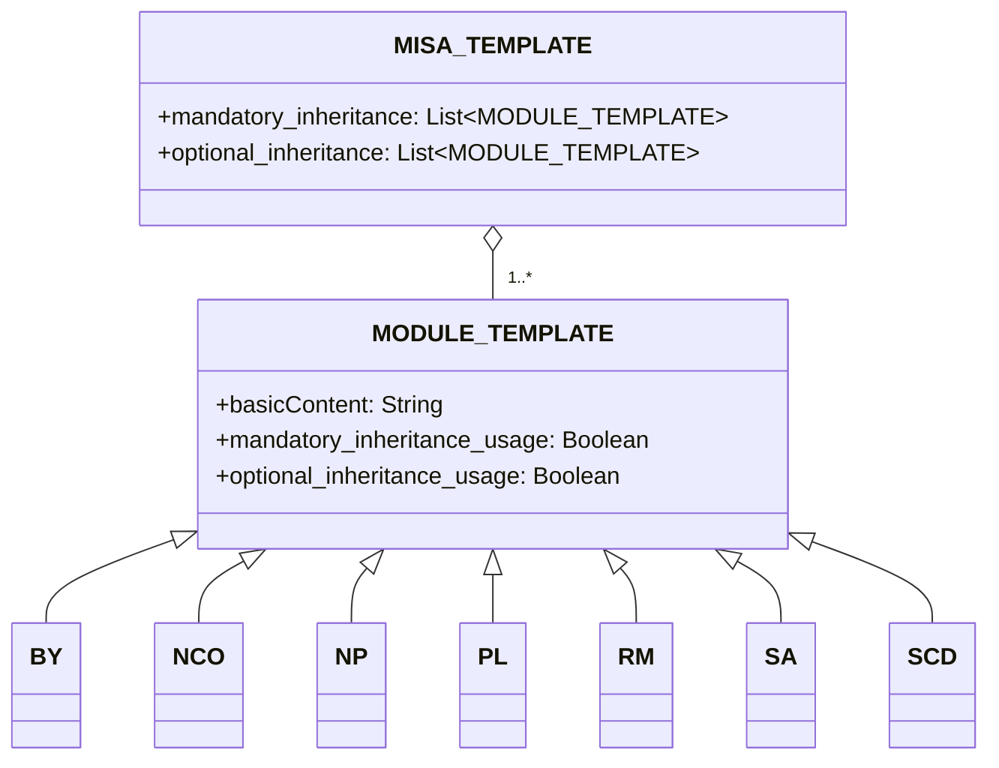

# Über
Das Modular and Inclusive Software Advancement (MISA)-Lizenzframework ist ein Lizenzframework, das basierend auf Ihren Anforderungen leicht angepasst werden kann. Das Framework selbst ist unter der neuesten Version der [MISA-CLASSIC](/MISA-CLASSIC.md)-Lizenz lizenziert.

"MISA-LF", die abgekürzte Version dieses Repository-Namens, ist ebenfalls eine akzeptable Variante für den Basisnamen, die der "Namenskontinuitätsverpflichtung" der Lizenz folgt.

Das MISA-Lizenzframework wurde entwickelt, um einen flexiblen und modularen Ansatz für Open-Source-Lizenzierung bereitzustellen. Durch die Kombination verschiedener Lizenzmodule können Benutzer benutzerdefinierte Lizenzen erstellen, die ihren spezifischen Anforderungen und Präferenzen entsprechen.

## Über MISA-CLASSIC.md
Es ist wichtig zu beachten, dass MISA-CLASSIC gleichbedeutend mit MISA-NCO ist, einer Lizenz, die aus dem Namenskontinuitätsverpflichtungs (NCO)-Modul besteht. Das bedeutet, dass jedes Projekt, das unter MISA-CLASSIC lizenziert ist, auch als unter MISA-NCO lizenziert betrachtet werden kann.

Die MISA-CLASSIC-Lizenz legte den Grundstein für die Entwicklung des MISA-Lizenzframeworks, das das Konzept der modularen Lizenzierung erweitert, indem es eine breite Palette anpassbarer Module einführt, die kombiniert werden können, um Lizenzen zu erstellen, die auf spezifische Anforderungen und Präferenzen zugeschnitten sind.

## Framework-Übersicht
Das MISA-Lizenzframework besteht aus den folgenden Komponenten:

1. MISA-CLASSIC.md: Die Basislizenz, die als Grundlage für das Framework dient.
2. Vorlagen:
   - MISA-TEMPLATE.md: Eine Vorlage zum Erstellen neuer MISA-basierter Lizenzen.
   - MODULE-TEMPLATE.md: Eine Vorlage zum Erstellen neuer Lizenzmodule.
3. Standardmodule: Eine Sammlung vordefinierter Lizenzmodule, die in MISA-basierten Lizenzen verwendet werden können.

## Framework-Struktur
Die Struktur des MISA-Lizenzframeworks kann mit dem folgenden Mermaid-Diagramm visualisiert werden:

## Standardmodule
Das MISA-Lizenzframework wird mit den folgenden Standardmodulen geliefert:

- [BY.md](/Default%20modules/BY.md): Namensnennung/Credit
- [NCO.md](/Default%20modules/NCO.md): Namenskontinuitätsverpflichtung
- [NP.md](/Default%20modules/NP.md): Non-Profit/Nicht-kommerziell
- [PL.md](/Default%20modules/PL.md): Patentlizenz
- [RM.md](/Default%20modules/RM.md): Gegenseitigkeit/Gegenseitige Lizenzierung
- [SA.md](/Default%20modules/SA.md): Copyleft/Share-Alike
- [SCD.md](/Default%20modules/SCD.md): Quellcode-Offenlegung

## Verwendung der Vorlagen
### Erstellen einer neuen MISA-basierten Lizenz
Um eine neue MISA-basierte Lizenz zu erstellen, führen Sie die folgenden Schritte aus:

1. Kopieren Sie den Inhalt von [MISA-TEMPLATE.md](/Templates/MISA-TEMPLATE.md) in eine neue Datei.
2. Ändern Sie die Abschnitte und Module entsprechend Ihren Anforderungen.
3. Speichern Sie die Datei mit einem geeigneten Namen und folgen Sie dabei der im Abschnitt "Namenskonvention" beschriebenen Namenskonvention.

### Hinzufügen eines neuen Lizenzmoduls
Um ein neues Lizenzmodul hinzuzufügen, führen Sie die folgenden Schritte aus:

1. Kopieren Sie den Inhalt von [MODULE-TEMPLATE.md](/Templates/MODULE-TEMPLATE.md) in eine neue Datei.
2. Füllen Sie die erforderlichen Informationen und Bedingungen für das Modul aus.
3. Speichern Sie die Datei mit einem geeigneten Namen und folgen Sie dabei der im Abschnitt "Namenskonvention" beschriebenen Namenskonvention.
4. Fügen Sie das neue Modul dem entsprechenden Abschnitt (Abschnitt 2 oder Abschnitt 5) Ihrer MISA-basierten Lizenz hinzu.

## Namenskonvention
Die Namenskonvention für MISA-basierte Lizenzen lautet wie folgt:

MISA-AA/BB/.../XX-aa/bb/.../xx-|xxx|

Wobei:
- AA/BB/.../XX stellen die obligatorischen Vererbungsbedingungen dar, unter Verwendung von Großbuchstaben.
- aa/bb/.../xx stellen die optionalen Vererbungsbedingungen dar, unter Verwendung von Kleinbuchstaben.
- |xxx| stellt eine kurze Beschreibung der zusätzlichen Bedingungen dar, die nicht von den vordefinierten Modulen abgedeckt werden, eingeschlossen in Pipe-Zeichen (|).

Zum Beispiel eine Lizenz, die aus den folgenden Standardmodulen besteht:
- Obligatorisch: Namenskontinuitätsverpflichtung (NCO), Quellcode-Offenlegung (SCD)
- Optional: Namensnennung/Credit (BY), Patentlizenz (PL)

Würde benannt werden: MISA-NCO/SCD-by/pl

Ein weiteres Beispiel, eine Lizenz mit:
- Obligatorisch: Copyleft/Share-Alike (SA), Non-Profit/Nicht-kommerziell (NP), Gegenseitigkeit/Gegenseitige Lizenzierung (RM)
- Zusätzliche Bedingungen: "Nicht für militärische Zwecke"

Würde benannt werden: MISA-SA/NP/RM-|Not for military use|

Für Lizenzmodule lautet die Namenskonvention:

ModulName (Abkürzung)

Wobei:
- ModulName ist der vollständige Name des Moduls.
- Abkürzung ist eine Kurzform des Modulnamens, eingeschlossen in Klammern.

## Hinweis zu rechtlichen Begriffen

Bitte beachten Sie, dass der Inhalt dieses Repositories, einschließlich des MISA-Lizenzframeworks, der Standardmodule und der Vorlagen, hauptsächlich mit großen Sprachmodellen (LLMs) generiert wurde. Obwohl wir uns bemüht haben, die Genauigkeit und Klarheit der hier präsentierten Informationen zu gewährleisten, kann es Fälle geben, in denen die verwendeten rechtlichen Begriffe nicht genau korrekt oder umfassend sind.

Wir ermutigen und begrüßen ausdrücklich Pull-Requests von Rechtsexperten und sachkundigen Personen, um uns dabei zu helfen, die in diesem Repository verwendete Rechtssprache zu verfeinern und zu verbessern. Ihre Beiträge werden von unschätzbarem Wert sein, um sicherzustellen, dass das MISA-Lizenzframework rechtlich solide ist und in realen Szenarien effektiv eingesetzt werden kann.

Wenn Sie rechtliche Ungenauigkeiten, unklare Formulierungen oder Verbesserungsvorschläge bemerken, zögern Sie bitte nicht, einen Pull-Request mit Ihren vorgeschlagenen Änderungen einzureichen. Gemeinsam können wir daran arbeiten, das MISA-Lizenzframework zu einem robusten und zuverlässigen Werkzeug für die Open-Source-Community zu machen.

Vielen Dank für Ihr Verständnis und Ihre Unterstützung bei dieser gemeinsamen Anstrengung, ein rechtlich präzises und umfassendes modulares Lizenzframework zu schaffen.