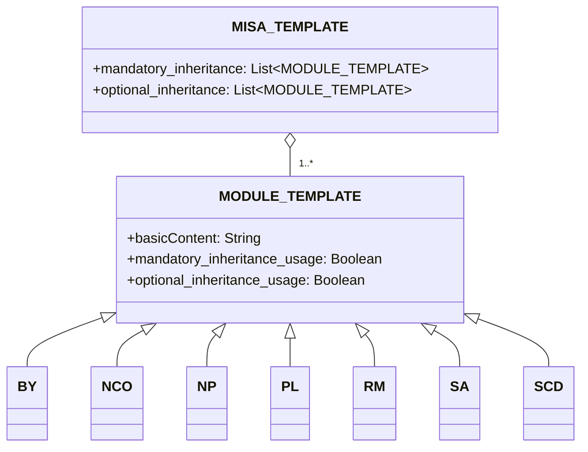

# Acerca de
El marco de licencia Modular and Inclusive Software Advancement (MISA) es un marco de licencia que se puede ajustar fácilmente según sus necesidades. El propio marco está licenciado bajo la última versión de la licencia [MISA-CLASSIC](/MISA-CLASSIC.md).

La versión abreviada del nombre de este repositorio, "MISA-LF", también es una variante aceptable para el nombre base que sigue la "Obligación de Continuidad de Nomenclatura" de la licencia.

El marco de licencia MISA está diseñado para proporcionar un enfoque flexible y modular para las licencias de código abierto. Al combinar varios módulos de licencia, los usuarios pueden crear licencias personalizadas que se ajusten a sus necesidades y preferencias específicas.

## Acerca de MISA-CLASSIC.md
Es importante tener en cuenta que MISA-CLASSIC es equivalente a MISA-NCO, que es una licencia compuesta por el módulo de Obligación de Continuidad de Nomenclatura (NCO). Esto significa que cualquier proyecto licenciado bajo MISA-CLASSIC también puede considerarse licenciado bajo MISA-NCO.

La licencia MISA-CLASSIC sentó las bases para el desarrollo del marco de licencia MISA, que amplía el concepto de licencias modulares al introducir una amplia gama de módulos personalizables que pueden combinarse para crear licencias adaptadas a necesidades y preferencias específicas.

## Esquema del Marco
El marco de licencia MISA consta de los siguientes componentes:

1. MISA-CLASSIC.md: La licencia base que sirve como fundamento para el marco.
2. Plantillas:
   - MISA-TEMPLATE.md: Una plantilla para crear nuevas licencias basadas en MISA.
   - MODULE-TEMPLATE.md: Una plantilla para crear nuevos módulos de licencia.
3. Módulos Predeterminados: Una colección de módulos de licencia predefinidos que se pueden usar en licencias basadas en MISA.

## Estructura del Marco
La estructura del marco de licencia MISA se puede visualizar usando el siguiente diagrama de mermaid:

## Módulos Predeterminados
El marco de licencia MISA viene con los siguientes módulos predeterminados:

- [BY.md](/Default%20modules/BY.md): Atribución/Crédito
- [NCO.md](/Default%20modules/NCO.md): Obligación de Continuidad de Nomenclatura
- [NP.md](/Default%20modules/NP.md): Sin Fines de Lucro/No Comercial
- [PL.md](/Default%20modules/PL.md): Licencia de Patente
- [RM.md](/Default%20modules/RM.md): Reciprocidad/Licencia Mutua
- [SA.md](/Default%20modules/SA.md): Copyleft/Compartir Igual
- [SCD.md](/Default%20modules/SCD.md): Divulgación de Código Fuente 

## Usando las Plantillas
### Creando una Nueva Licencia Basada en MISA
Para crear una nueva licencia basada en MISA, siga estos pasos:

1. Copie el contenido de [MISA-TEMPLATE.md](/Templates/MISA-TEMPLATE.md) en un nuevo archivo.
2. Modifique las secciones y módulos de acuerdo con sus requisitos.
3. Guarde el archivo con un nombre apropiado, siguiendo la convención de nomenclatura descrita en la sección "Convención de Nomenclatura".

### Agregando un Nuevo Módulo de Licencia
Para agregar un nuevo módulo de licencia, siga estos pasos:

1. Copie el contenido de [MODULE-TEMPLATE.md](/Templates/MODULE-TEMPLATE.md) en un nuevo archivo.
2. Complete la información y las condiciones necesarias para el módulo.
3. Guarde el archivo con un nombre apropiado, siguiendo la convención de nomenclatura descrita en la sección "Convención de Nomenclatura".
4. Agregue el nuevo módulo a la sección apropiada (Sección 2 o Sección 5) de su licencia basada en MISA.

## Convención de Nomenclatura
La convención de nomenclatura para las licencias basadas en MISA es la siguiente:

MISA-AA/BB/.../XX-aa/bb/.../xx-|xxx|

Donde:
- AA/BB/.../XX representan las condiciones de herencia obligatorias, usando letras mayúsculas.
- aa/bb/.../xx representan las condiciones de herencia opcionales, usando letras minúsculas.
- |xxx| representa una breve descripción de las condiciones adicionales no cubiertas por los módulos predefinidos, encerrada entre caracteres de barra vertical (|).

Por ejemplo, una licencia compuesta por los siguientes módulos predeterminados:
- Obligatorios: Obligación de Continuidad de Nomenclatura (NCO), Divulgación de Código Fuente (SCD)
- Opcionales: Atribución/Crédito (BY), Licencia de Patente (PL)

Se llamaría: MISA-NCO/SCD-by/pl

Otro ejemplo, una licencia con:
- Obligatorios: Copyleft/Compartir Igual (SA), Sin Fines de Lucro/No Comercial (NP), Reciprocidad/Licencia Mutua (RM)
- Condiciones adicionales: "No para uso militar"

Se llamaría: MISA-SA/NP/RM-|Not for military use|

Para los módulos de licencia, la convención de nomenclatura es:

NombreDelMódulo (Abreviatura)

Donde:
- NombreDelMódulo es el nombre completo del módulo.
- Abreviatura es una forma corta del nombre del módulo, encerrada entre paréntesis.

## Nota sobre Terminología Legal

Tenga en cuenta que el contenido de este repositorio, incluido el marco de licencia MISA, los módulos predeterminados y las plantillas, se generó principalmente utilizando Modelos de Lenguaje Grande (LLM). Si bien hemos hecho todo lo posible para garantizar la precisión y claridad de la información presentada aquí, puede haber casos en los que la terminología legal utilizada no sea precisamente correcta o completa.

Alentamos y agradecemos los pull requests de expertos legales y personas con conocimientos para ayudarnos a refinar y mejorar el lenguaje legal utilizado en todo este repositorio. Sus contribuciones serán invaluables para garantizar que el marco de licencia MISA sea legalmente sólido y pueda utilizarse de manera efectiva en escenarios del mundo real.

Si nota alguna inexactitud legal, redacción poco clara o tiene sugerencias de mejora, no dude en enviar un pull request con sus cambios propuestos. Juntos, podemos trabajar para hacer del marco de licencia MISA una herramienta robusta y confiable para la comunidad de código abierto.

Gracias por su comprensión y apoyo en este esfuerzo colaborativo para crear un marco de licencia modular legalmente preciso e integral.