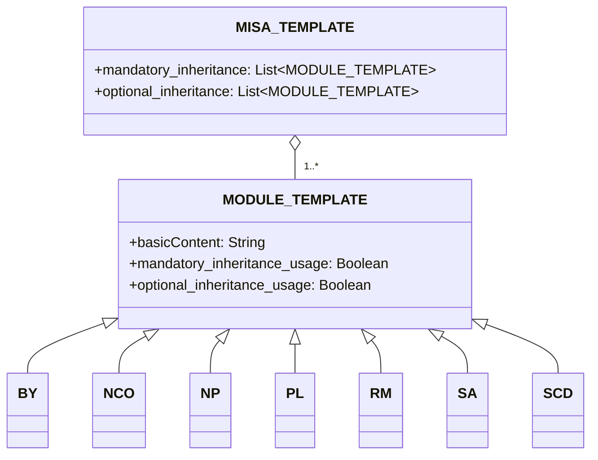

# À propos
Le cadre de licence Modular and Inclusive Software Advancement (MISA) est un cadre de licence facilement ajustable en fonction de vos besoins. Le cadre lui-même est sous licence selon la dernière version de la licence [MISA-CLASSIC](/MISA-CLASSIC.md).

"MISA-LF", la version abrégée du nom de ce dépôt, est également une variante acceptable pour le nom de base suivant l'"Obligation de Continuité de Dénomination" de la licence.

Le cadre de licence MISA est conçu pour fournir une approche flexible et modulaire des licences open source. En combinant divers modules de licence, les utilisateurs peuvent créer des licences personnalisées adaptées à leurs besoins et préférences spécifiques.

## À propos de MISA-CLASSIC.md
Il est important de noter que MISA-CLASSIC est équivalent à MISA-NCO, qui est une licence composée du module Obligation de Continuité de Dénomination (NCO). Cela signifie que tout projet sous licence MISA-CLASSIC peut également être considéré comme étant sous licence MISA-NCO.

La licence MISA-CLASSIC a jeté les bases du développement du cadre de licence MISA, qui étend le concept de licence modulaire en introduisant une large gamme de modules personnalisables pouvant être combinés pour créer des licences adaptées à des besoins et préférences spécifiques.

## Aperçu du cadre
Le cadre de licence MISA se compose des éléments suivants :

1. MISA-CLASSIC.md : La licence de base qui sert de fondement au cadre.
2. Modèles :
   - MISA-TEMPLATE.md : Un modèle pour créer de nouvelles licences basées sur MISA.
   - MODULE-TEMPLATE.md : Un modèle pour créer de nouveaux modules de licence.
3. Modules par défaut : Une collection de modules de licence prédéfinis pouvant être utilisés dans les licences basées sur MISA.

## Structure du cadre
La structure du cadre de licence MISA peut être visualisée à l'aide du diagramme mermaid suivant :

## Modules par défaut
Le cadre de licence MISA est livré avec les modules par défaut suivants :

- [BY.md](/Default%20modules/BY.md) : Attribution/Crédit
- [NCO.md](/Default%20modules/NCO.md) : Obligation de Continuité de Dénomination
- [NP.md](/Default%20modules/NP.md) : Non lucratif/Non commercial
- [PL.md](/Default%20modules/PL.md) : Licence de brevet
- [RM.md](/Default%20modules/RM.md) : Réciprocité/Licence mutuelle
- [SA.md](/Default%20modules/SA.md) : Copyleft/Partage à l'identique
- [SCD.md](/Default%20modules/SCD.md) : Divulgation du code source

## Utilisation des modèles
### Création d'une nouvelle licence basée sur MISA
Pour créer une nouvelle licence basée sur MISA, suivez ces étapes :

1. Copiez le contenu de [MISA-TEMPLATE.md](/Templates/MISA-TEMPLATE.md) dans un nouveau fichier.
2. Modifiez les sections et les modules en fonction de vos besoins.
3. Enregistrez le fichier avec un nom approprié, en suivant la convention de dénomination décrite dans la section "Convention de dénomination".

### Ajout d'un nouveau module de licence
Pour ajouter un nouveau module de licence, suivez ces étapes :

1. Copiez le contenu de [MODULE-TEMPLATE.md](/Templates/MODULE-TEMPLATE.md) dans un nouveau fichier.
2. Remplissez les informations et conditions nécessaires pour le module.
3. Enregistrez le fichier avec un nom approprié, en suivant la convention de dénomination décrite dans la section "Convention de dénomination".
4. Ajoutez le nouveau module à la section appropriée (Section 2 ou Section 5) de votre licence basée sur MISA.

## Convention de dénomination
La convention de dénomination pour les licences basées sur MISA est la suivante :

MISA-AA/BB/.../XX-aa/bb/.../xx-|xxx|

Où :
- AA/BB/.../XX représentent les conditions d'héritage obligatoires, en utilisant des lettres majuscules.
- aa/bb/.../xx représentent les conditions d'héritage optionnelles, en utilisant des lettres minuscules.
- |xxx| représente une brève description des conditions supplémentaires non couvertes par les modules prédéfinis, entourée de caractères de barre verticale (|).

Par exemple, une licence composée des modules par défaut suivants :
- Obligatoire : Obligation de Continuité de Dénomination (NCO), Divulgation du code source (SCD)
- Optionnel : Attribution/Crédit (BY), Licence de brevet (PL)

Serait nommée : MISA-NCO/SCD-by/pl

Un autre exemple, une licence avec :
- Obligatoire : Copyleft/Partage à l'identique (SA), Non lucratif/Non commercial (NP), Réciprocité/Licence mutuelle (RM)
- Conditions supplémentaires : "Pas pour un usage militaire"

Serait nommée : MISA-SA/NP/RM-|Not for military use|

Pour les modules de licence, la convention de dénomination est la suivante :

NomModule (Abréviation)

Où :
- NomModule est le nom complet du module.
- Abréviation est une forme abrégée du nom du module, entre parenthèses.

## Note sur la terminologie juridique

Veuillez noter que le contenu de ce dépôt, y compris le cadre de licence MISA, les modules par défaut et les modèles, a été principalement généré à l'aide de Grands Modèles de Langage (LLM). Bien que nous ayons fait tout notre possible pour garantir l'exactitude et la clarté des informations présentées ici, il peut y avoir des cas où la terminologie juridique utilisée n'est pas précisément correcte ou complète.

Nous encourageons vivement et accueillons favorablement les pull requests d'experts juridiques et de personnes bien informées pour nous aider à affiner et à améliorer le langage juridique utilisé dans ce dépôt. Vos contributions seront précieuses pour garantir que le cadre de licence MISA est juridiquement solide et peut être utilisé efficacement dans des scénarios réels.

Si vous remarquez des inexactitudes juridiques, des formulations peu claires ou si vous avez des suggestions d'amélioration, n'hésitez pas à soumettre une pull request avec vos modifications proposées. Ensemble, nous pouvons travailler à faire du cadre de licence MISA un outil robuste et fiable pour la communauté open source.

Merci pour votre compréhension et votre soutien dans cet effort collaboratif visant à créer un cadre de licence modulaire juridiquement précis et complet.