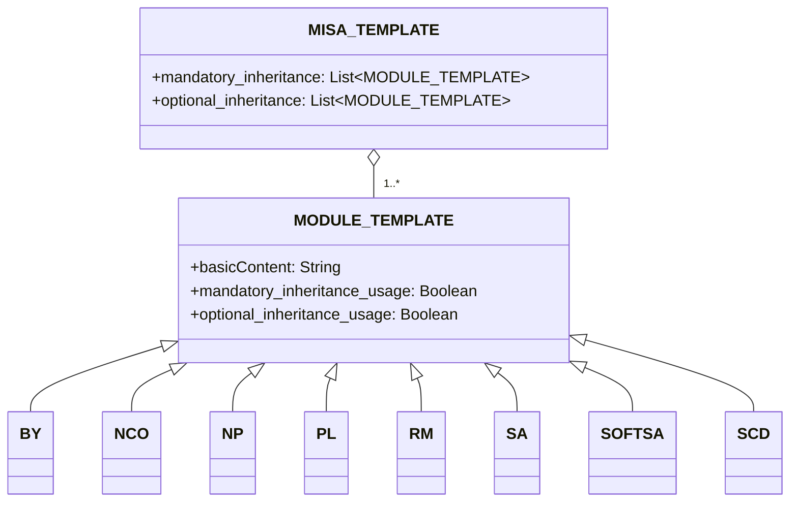

# परिचय
Modular and Inclusive Software Advancement (MISA) लाइसेंस फ्रेमवर्क एक ऐसा लाइसेंस फ्रेमवर्क है जिसे आपकी आवश्यकताओं के आधार पर आसानी से समायोजित किया जा सकता है। फ्रेमवर्क स्वयं [MISA-CLASSIC](/MISA-CLASSIC.md) लाइसेंस के नवीनतम संस्करण के तहत लाइसेंस प्राप्त है।

इस रिपॉजिटरी के नाम का संक्षिप्त संस्करण "MISA-LF" भी बेस नाम के लिए एक स्वीकार्य विकल्प है जो लाइसेंस के "नामकरण निरंतरता दायित्व" का पालन करता है।

MISA लाइसेंस फ्रेमवर्क को ओपन सोर्स लाइसेंसिंग के लिए एक लचीला और मॉड्यूलर दृष्टिकोण प्रदान करने के लिए डिज़ाइन किया गया है। विभिन्न लाइसेंस मॉड्यूल को जोड़कर, उपयोगकर्ता अपनी विशिष्ट आवश्यकताओं और प्राथमिकताओं के अनुरूप कस्टम लाइसेंस बना सकते हैं।

## MISA-CLASSIC.md के बारे में
यह ध्यान देने योग्य है कि MISA-CLASSIC, MISA-NCO के समान है, जो नामकरण निरंतरता दायित्व (NCO) मॉड्यूल से बना एक लाइसेंस है। इसका मतलब है कि MISA-CLASSIC के तहत लाइसेंस प्राप्त किसी भी प्रोजेक्ट को MISA-NCO के तहत भी लाइसेंस प्राप्त माना जा सकता है।

MISA-CLASSIC लाइसेंस ने MISA लाइसेंस फ्रेमवर्क के विकास की नींव रखी, जो विशिष्ट आवश्यकताओं और प्राथमिकताओं के अनुरूप लाइसेंस बनाने के लिए संयोजित किए जा सकने वाले अनुकूलन योग्य मॉड्यूल की एक विस्तृत श्रृंखला पेश करके मॉड्यूलर लाइसेंसिंग की अवधारणा का विस्तार करता है।

## फ्रेमवर्क की रूपरेखा
MISA लाइसेंस फ्रेमवर्क निम्नलिखित घटकों से बना है:

1. MISA-CLASSIC.md: मूल लाइसेंस जो फ्रेमवर्क के लिए आधार के रूप में काम करता है।
2. टेम्पलेट्स:
   - MISA-TEMPLATE.md: MISA आधारित नए लाइसेंस बनाने के लिए एक टेम्पलेट।
   - MODULE-TEMPLATE.md: नए लाइसेंस मॉड्यूल बनाने के लिए एक टेम्पलेट।
3. डिफ़ॉल्ट मॉड्यूल: पूर्व-परिभाषित लाइसेंस मॉड्यूल का एक संग्रह जिन्हें MISA आधारित लाइसेंस में उपयोग किया जा सकता है।

## फ्रेमवर्क संरचना
MISA लाइसेंस फ्रेमवर्क की संरचना को निम्नलिखित mermaid आरेख का उपयोग करके दर्शाया जा सकता है:

## डिफ़ॉल्ट मॉड्यूल
MISA लाइसेंस फ्रेमवर्क निम्नलिखित डिफ़ॉल्ट मॉड्यूल के साथ आता है:

- [BY.md](/Default%20modules/BY.md): एट्रीब्यूशन/क्रेडिट
- [NCO.md](/Default%20modules/NCO.md): नामकरण निरंतरता दायित्व
- [NP.md](/Default%20modules/NP.md): गैर-लाभकारी/गैर-वाणिज्यिक
- [PL.md](/Default%20modules/PL.md): पेटेंट लाइसेंस
- [RM.md](/Default%20modules/RM.md): पारस्परिकता/पारस्परिक लाइसेंसिंग
- [SA.md](/Default%20modules/SA.md): कॉपीलेफ्ट/शेयर-अलाइक
- [SOFTSA.md](/Default%20modules/SOFTSA.md): सॉफ़्ट कॉपीलेफ़्ट/शेयर-अलाइक (केवल फॉर्क्स को लक्षित करता है)
- [SCD.md](/Default%20modules/SCD.md): सोर्स कोड प्रकटीकरण

## टेम्पलेट्स का उपयोग करना
### नया MISA आधारित लाइसेंस बनाना
एक नया MISA आधारित लाइसेंस बनाने के लिए, निम्न चरणों का पालन करें:

1. [MISA-TEMPLATE.md](/Templates/MISA-TEMPLATE.md) की सामग्री को एक नई फ़ाइल में कॉपी करें।
2. अपनी आवश्यकताओं के अनुसार सेक्शंस और मॉड्यूल को संशोधित करें।
3. "नामकरण कन्वेंशन" सेक्शन में वर्णित नामकरण कन्वेंशन का पालन करते हुए उपयुक्त नाम के साथ फ़ाइल सेव करें।

### नया लाइसेंस मॉड्यूल जोड़ना
एक नया लाइसेंस मॉड्यूल जोड़ने के लिए, निम्न चरणों का पालन करें:

1. [MODULE-TEMPLATE.md](/Templates/MODULE-TEMPLATE.md) की सामग्री को एक नई फ़ाइल में कॉपी करें।
2. मॉड्यूल के लिए आवश्यक जानकारी और शर्तें भरें।
3. "नामकरण कन्वेंशन" सेक्शन में वर्णित नामकरण कन्वेंशन का पालन करते हुए उपयुक्त नाम के साथ फ़ाइल सेव करें।
4. अपने MISA आधारित लाइसेंस के उपयुक्त सेक्शन (सेक्शन 2 या सेक्शन 5) में नया मॉड्यूल जोड़ें।

## नामकरण कन्वेंशन
MISA आधारित लाइसेंस के लिए नामकरण कन्वेंशन निम्नानुसार है:

MISA-AA/BB/.../XX-aa/bb/.../xx-|xxx|

जहां:
- AA/BB/.../XX अनिवार्य विरासत शर्तों को दर्शाते हैं, बड़े अक्षरों का उपयोग करके।
- aa/bb/.../xx वैकल्पिक विरासत शर्तों को दर्शाते हैं, छोटे अक्षरों का उपयोग करके।
- |xxx| पूर्व-परिभाषित मॉड्यूल द्वारा कवर नहीं की गई अतिरिक्त शर्तों का संक्षिप्त विवरण दर्शाता है, जो पाइप वर्णों (|) के बीच होता है।

उदाहरण के लिए, निम्नलिखित डिफ़ॉल्ट मॉड्यूल से बना एक लाइसेंस:
- अनिवार्य: नामकरण निरंतरता दायित्व (NCO), सोर्स कोड प्रकटीकरण (SCD)
- वैकल्पिक: एट्रीब्यूशन/क्रेडिट (BY), पेटेंट लाइसेंस (PL)

इसका नाम होगा: MISA-NCO/SCD-by/pl

एक और उदाहरण, इन शर्तों वाला लाइसेंस:
- अनिवार्य: कॉपीलेफ्ट/शेयर-अलाइक (SA), गैर-लाभकारी/गैर-वाणिज्यिक (NP), पारस्परिकता/पारस्परिक लाइसेंसिंग (RM)
- अतिरिक्त शर्तें: "सैन्य उपयोग के लिए नहीं"

इसका नाम होगा: MISA-SA/NP/RM-|Not for military use|

लाइसेंस मॉड्यूल के लिए, नामकरण कन्वेंशन है:

ModuleName (Abbreviation)

जहां:
- ModuleName मॉड्यूल का पूर्ण नाम है।
- Abbreviation मॉड्यूल नाम का एक संक्षिप्त रूप है, जो कोष्ठक में होता है।

## कानूनी शब्दावली के बारे में नोट

कृपया ध्यान दें कि इस रिपॉजिटरी की सामग्री, जिसमें MISA लाइसेंस फ्रेमवर्क, डिफ़ॉल्ट मॉड्यूल और टेम्पलेट्स शामिल हैं, मुख्य रूप से लार्ज लैंग्वेज मॉडल (LLMs) का उपयोग करके जनरेट किए गए थे। हालांकि हमने यहां प्रस्तुत की गई जानकारी की सटीकता और स्पष्टता सुनिश्चित करने का हर संभव प्रयास किया है, ऐसे मामले हो सकते हैं जहां उपयोग किए गए कानूनी शब्द ठीक से सही या व्यापक नहीं हैं।

हम इस रिपॉजिटरी में उपयोग की जाने वाली कानूनी भाषा को परिष्कृत और बेहतर बनाने में हमारी सहायता करने के लिए कानूनी विशेषज्ञों और जानकार व्यक्तियों से पुल रिक्वेस्ट को दृढ़ता से प्रोत्साहित करते हैं और स्वागत करते हैं। आपका योगदान यह सुनिश्चित करने में अमूल्य होगा कि MISA लाइसेंस फ्रेमवर्क कानूनी रूप से मजबूत है और वास्तविक दुनिया के परिदृश्यों में प्रभावी ढंग से उपयोग किया जा सकता है।

यदि आप कोई कानूनी अशुद्धि, अस्पष्ट शब्दावली देखते हैं, या सुधार के लिए सुझाव देना चाहते हैं, तो कृपया अपने प्रस्तावित परिवर्तनों के साथ एक पुल रिक्वेस्ट सबमिट करने में संकोच न करें। एक साथ, हम ओपन सोर्स समुदाय के लिए MISA लाइसेंस फ्रेमवर्क को एक मजबूत और विश्वसनीय उपकरण बनाने के लिए काम कर सकते हैं।

कानूनी रूप से सटीक और व्यापक मॉड्यूलर लाइसेंस फ्रेमवर्क बनाने के लिए इस सहयोगात्मक प्रयास में आपकी समझ और समर्थन के लिए धन्यवाद।