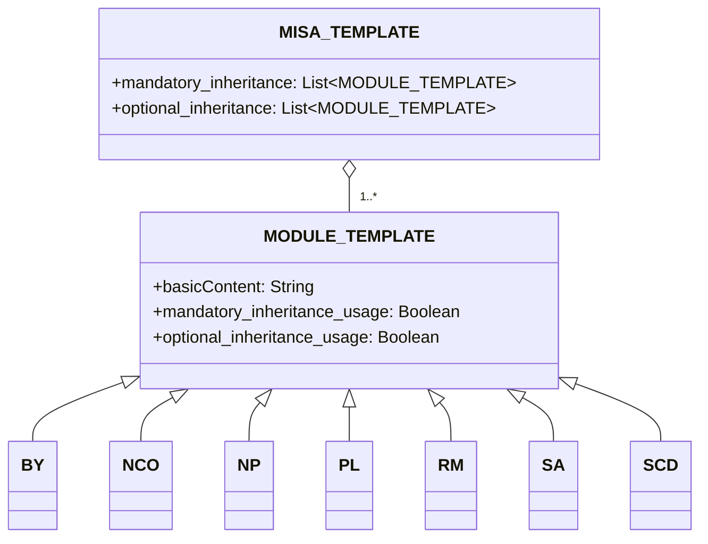

# Informazioni
Il framework di licenza Modular and Inclusive Software Advancement (MISA) è un framework di licenza facilmente regolabile in base alle tue esigenze. Il framework stesso è concesso in licenza secondo l'ultima versione della licenza [MISA-CLASSIC](/MISA-CLASSIC.md).

"MISA-LF", la versione abbreviata del nome di questo repository, è anche una variante accettabile per il nome di base che segue l'"Obbligo di Continuità di Denominazione" della licenza.

Il framework di licenza MISA è progettato per fornire un approccio flessibile e modulare alle licenze open source. Combinando vari moduli di licenza, gli utenti possono creare licenze personalizzate adatte alle loro esigenze e preferenze specifiche.

## Informazioni su MISA-CLASSIC.md
È importante notare che MISA-CLASSIC è equivalente a MISA-NCO, che è una licenza composta dal modulo Obbligo di Continuità di Denominazione (NCO). Ciò significa che qualsiasi progetto concesso in licenza con MISA-CLASSIC può anche essere considerato concesso in licenza con MISA-NCO.

La licenza MISA-CLASSIC ha gettato le basi per lo sviluppo del framework di licenza MISA, che espande il concetto di licenze modulari introducendo un'ampia gamma di moduli personalizzabili che possono essere combinati per creare licenze su misura per esigenze e preferenze specifiche.

## Struttura del Framework
Il framework di licenza MISA è composto dai seguenti componenti:

1. MISA-CLASSIC.md: La licenza di base che funge da fondamento per il framework.
2. Modelli:
   - MISA-TEMPLATE.md: Un modello per creare nuove licenze basate su MISA.
   - MODULE-TEMPLATE.md: Un modello per creare nuovi moduli di licenza.
3. Moduli predefiniti: Una raccolta di moduli di licenza predefiniti che possono essere utilizzati nelle licenze basate su MISA.

## Struttura del Framework
La struttura del framework di licenza MISA può essere visualizzata utilizzando il seguente diagramma mermaid:

## Moduli predefiniti
Il framework di licenza MISA viene fornito con i seguenti moduli predefiniti:

- [BY.md](/Default%20modules/BY.md): Attribuzione/Credito
- [NCO.md](/Default%20modules/NCO.md): Obbligo di Continuità di Denominazione
- [NP.md](/Default%20modules/NP.md): Non Profit/Non Commerciale
- [PL.md](/Default%20modules/PL.md): Licenza di Brevetto
- [RM.md](/Default%20modules/RM.md): Reciprocità/Licenza Reciproca
- [SA.md](/Default%20modules/SA.md): Copyleft/Condivisione allo stesso modo
- [SCD.md](/Default%20modules/SCD.md): Divulgazione del Codice Sorgente

## Utilizzo dei Modelli
### Creazione di una nuova licenza basata su MISA
Per creare una nuova licenza basata su MISA, segui questi passaggi:

1. Copia il contenuto di [MISA-TEMPLATE.md](/Templates/MISA-TEMPLATE.md) in un nuovo file.
2. Modifica le sezioni e i moduli in base alle tue esigenze.
3. Salva il file con un nome appropriato, seguendo la convenzione di denominazione descritta nella sezione "Convenzione di denominazione".

### Aggiunta di un nuovo modulo di licenza
Per aggiungere un nuovo modulo di licenza, segui questi passaggi:

1. Copia il contenuto di [MODULE-TEMPLATE.md](/Templates/MODULE-TEMPLATE.md) in un nuovo file.
2. Compila le informazioni e le condizioni necessarie per il modulo.
3. Salva il file con un nome appropriato, seguendo la convenzione di denominazione descritta nella sezione "Convenzione di denominazione".
4. Aggiungi il nuovo modulo alla sezione appropriata (Sezione 2 o Sezione 5) della tua licenza basata su MISA.

## Convenzione di denominazione
La convenzione di denominazione per le licenze basate su MISA è la seguente:

MISA-AA/BB/.../XX-aa/bb/.../xx-|xxx|

Dove:
- AA/BB/.../XX rappresentano le condizioni di ereditarietà obbligatorie, utilizzando lettere maiuscole.
- aa/bb/.../xx rappresentano le condizioni di ereditarietà opzionali, utilizzando lettere minuscole.
- |xxx| rappresenta una breve descrizione delle condizioni aggiuntive non coperte dai moduli predefiniti, racchiusa tra caratteri pipe (|).

Ad esempio, una licenza composta dai seguenti moduli predefiniti:
- Obbligatorio: Obbligo di Continuità di Denominazione (NCO), Divulgazione del Codice Sorgente (SCD)
- Opzionale: Attribuzione/Credito (BY), Licenza di Brevetto (PL)

Sarebbe denominata: MISA-NCO/SCD-by/pl

Un altro esempio, una licenza con:
- Obbligatorio: Copyleft/Condivisione allo stesso modo (SA), Non Profit/Non Commerciale (NP), Reciprocità/Licenza Reciproca (RM)
- Condizioni aggiuntive: "Non per uso militare"

Sarebbe denominata: MISA-SA/NP/RM-|Not for military use|

Per i moduli di licenza, la convenzione di denominazione è:

NomeModulo (Abbreviazione)

Dove:
- NomeModulo è il nome completo del modulo.
- Abbreviazione è una forma abbreviata del nome del modulo, racchiusa tra parentesi.

## Nota sulla terminologia legale

Si prega di notare che il contenuto di questo repository, incluso il framework di licenza MISA, i moduli predefiniti e i modelli, è stato principalmente generato utilizzando Modelli di Linguaggio di Grandi Dimensioni (LLM). Mentre abbiamo fatto ogni sforzo per garantire l'accuratezza e la chiarezza delle informazioni qui presentate, potrebbero esserci casi in cui la terminologia legale utilizzata non è precisamente corretta o completa.

Incoraggiamo vivamente e accogliamo con favore le richieste di pull da esperti legali e individui ben informati per aiutarci a raffinare e migliorare il linguaggio legale utilizzato in tutto questo repository. I vostri contributi saranno inestimabili per garantire che il framework di licenza MISA sia legalmente solido e possa essere utilizzato efficacemente in scenari del mondo reale.

Se notate imprecisioni legali, formulazioni poco chiare o avete suggerimenti per miglioramenti, non esitate a inviare una richiesta di pull con le modifiche proposte. Insieme, possiamo lavorare per rendere il framework di licenza MISA uno strumento robusto e affidabile per la comunità open source.

Grazie per la vostra comprensione e il vostro supporto in questo sforzo collaborativo per creare un framework di licenza modulare legalmente preciso e completo.