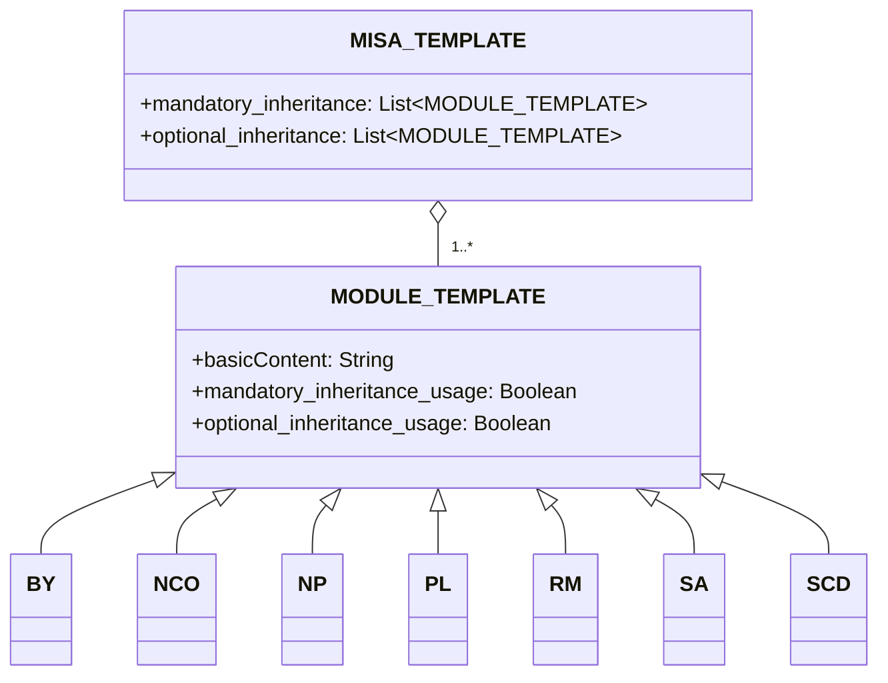

# 概要
Modular and Inclusive Software Advancement (MISA) ライセンスフレームワークは、ニーズに基づいて簡単に調整できるライセンスフレームワークです。フレームワーク自体は、[MISA-CLASSIC](/MISA-CLASSIC.md)ライセンスの最新バージョンでライセンスされています。

このリポジトリの略称である"MISA-LF"も、ライセンスの"名称継承義務"に従うベース名の許容可能な変種です。

MISAライセンスフレームワークは、オープンソースライセンスに柔軟でモジュール化されたアプローチを提供するように設計されています。さまざまなライセンスモジュールを組み合わせることで、ユーザーは特定のニーズや好みに合ったカスタムライセンスを作成できます。

## MISA-CLASSIC.mdについて
MISA-CLASSICは、名称継承義務（NCO）モジュールで構成されるライセンスであるMISA-NCOと同等であることに注意してください。つまり、MISA-CLASSICでライセンスされたプロジェクトは、MISA-NCOでライセンスされていると見なすこともできます。

MISA-CLASSICライセンスは、特定のニーズや好みに合わせてカスタマイズできる幅広いモジュールを導入することで、モジュラーライセンスの概念を拡張するMISAライセンスフレームワークの開発の基礎を築きました。

## フレームワークの概要
MISAライセンスフレームワークは、以下のコンポーネントで構成されています。

1. MISA-CLASSIC.md：フレームワークの基礎となる基本ライセンス。
2. テンプレート：
   - MISA-TEMPLATE.md：新しいMISAベースのライセンスを作成するためのテンプレート。
   - MODULE-TEMPLATE.md：新しいライセンスモジュールを作成するためのテンプレート。
3. デフォルトモジュール：MISAベースのライセンスで使用できる定義済みライセンスモジュールのコレクション。

## フレームワーク構造
MISAライセンスフレームワークの構造は、次のmermaid図を使用して視覚化できます。

## デフォルトモジュール
MISAライセンスフレームワークには、次のデフォルトモジュールが付属しています。

- [BY.md](/Default%20modules/BY.md)：帰属/クレジット
- [NCO.md](/Default%20modules/NCO.md)：名称継承義務
- [NP.md](/Default%20modules/NP.md): 非営利/非商用
- [PL.md](/Default%20modules/PL.md)：特許ライセンス
- [RM.md](/Default%20modules/RM.md)：相互主義/相互ライセンス
- [SA.md](/Default%20modules/SA.md)：コピーレフト/シェアアライク 
- [SCD.md](/Default%20modules/SCD.md)：ソースコード開示

## テンプレートの使用
### 新しいMISAベースのライセンスの作成
新しいMISAベースのライセンスを作成するには、次の手順を実行します。

1. [MISA-TEMPLATE.md](/Templates/MISA-TEMPLATE.md)の内容を新しいファイルにコピーします。
2. 要件に従ってセクションとモジュールを変更します。
3. "命名規則"セクションで説明されている命名規則に従って、適切な名前でファイルを保存します。

### 新しいライセンスモジュールの追加
新しいライセンスモジュールを追加するには、次の手順を実行します。

1. [MODULE-TEMPLATE.md](/Templates/MODULE-TEMPLATE.md)の内容を新しいファイルにコピーします。
2. モジュールに必要な情報と条件を記入します。  
3. "命名規則"セクションで説明されている命名規則に従って、適切な名前でファイルを保存します。
4. 新しいモジュールをMISAベースのライセンスの適切なセクション（セクション2またはセクション5）に追加します。

## 命名規則
MISAベースのライセンスの命名規則は次のとおりです。

MISA-AA/BB/.../XX-aa/bb/.../xx-|xxx|

ここで:
- AA/BB/.../XXは、大文字を使用して必須の継承条件を表します。
- aa/bb/.../xxは、小文字を使用してオプションの継承条件を表します。
- |xxx|は、定義済みのモジュールでカバーされていない追加の条件の簡単な説明を表し、パイプ文字（|）で囲みます。

たとえば、次のデフォルトモジュールで構成されるライセンス：
- 必須：名称継承義務（NCO）、ソースコード開示（SCD）
- オプション：帰属/クレジット（BY）、特許ライセンス（PL）

は、MISA-NCO/SCD-by/plという名前になります。

別の例として、以下のようなライセンスの場合：
- 必須：コピーレフト/シェアアライク（SA）、非営利/非商用（NP）、相互主義/相互ライセンス（RM）
- 追加条件："軍事利用不可"

は、MISA-SA/NP/RM-|Not for military use|という名前になります。

ライセンスモジュールの命名規則は次のとおりです。

ModuleName (Abbreviation)

ここで：
- ModuleNameはモジュールのフルネームです。
- Abbreviationは、モジュール名の短縮形で、括弧で囲みます。

## 法的用語についての注意

このリポジトリの内容（MISAライセンスフレームワーク、デフォルトモジュール、およびテンプレートを含む）は、主に大規模言語モデル（LLM）を使用して生成されたものであることに注意してください。ここに提示された情報の正確性と明確さを確保するためにあらゆる努力をしましたが、使用されている法的用語が正確または包括的でない場合があります。

法律の専門家や知識のある個人からのプルリクエストを歓迎し、奨励します。皆様の協力により、このリポジトリ全体で使用される法的言語を洗練し、改善することができます。皆様からの貢献は、MISAライセンスフレームワークを法的に適切なものにし、実世界のシナリオで効果的に使用できるようにするために非常に貴重なものとなります。

法的な不正確さ、不明確な表現、または改善の提案に気付いた場合は、ためらわずに変更案を含むプルリクエストを送信してください。私たちは協力して、MISAライセンスフレームワークを堅牢で信頼できるオープンソースコミュニティ向けのツールにしていきましょう。

法的に正確で包括的なモジュラーライセンスフレームワークを作成するための共同作業における皆様のご理解とご支援に感謝いたします。