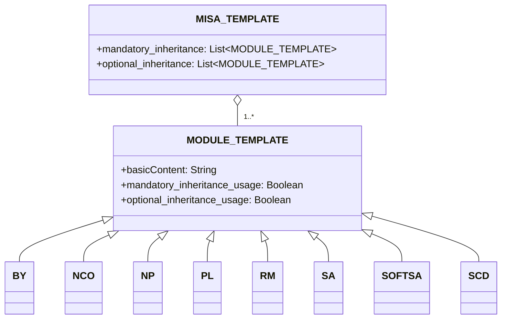

# 소개
Modular and Inclusive Software Advancement (MISA) 라이선스 프레임워크는 요구 사항에 따라 쉽게 조정할 수 있는 라이선스 프레임워크입니다. 프레임워크 자체는 최신 버전의 [MISA-CLASSIC](/MISA-CLASSIC.md) 라이선스에 따라 라이선스가 부여됩니다.

이 저장소 이름의 약어 버전인 "MISA-LF"도 라이선스의 "명명 연속성 의무"를 따르는 기본 이름에 대한 허용 가능한 변형입니다.

MISA 라이선스 프레임워크는 오픈 소스 라이선싱에 대한 유연하고 모듈식 접근 방식을 제공하도록 설계되었습니다. 다양한 라이선스 모듈을 조합하여 사용자는 특정 요구 사항과 선호도에 맞는 맞춤형 라이선스를 생성할 수 있습니다.

## MISA-CLASSIC.md 소개
MISA-CLASSIC은 명명 연속성 의무(NCO) 모듈로 구성된 라이선스인 MISA-NCO와 동일하다는 점에 유의해야 합니다. 즉, MISA-CLASSIC에 따라 라이선스가 부여된 모든 프로젝트는 MISA-NCO에 따라 라이선스가 부여된 것으로도 간주될 수 있습니다.

MISA-CLASSIC 라이선스는 특정 요구 사항과 선호도에 맞게 조정된 라이선스를 생성하기 위해 결합할 수 있는 다양한 사용자 정의 가능한 모듈을 도입함으로써 모듈식 라이선싱 개념을 확장하는 MISA 라이선스 프레임워크 개발의 기반을 마련했습니다.

## 프레임워크 개요
MISA 라이선스 프레임워크는 다음과 같은 구성 요소로 이루어져 있습니다:

1. MISA-CLASSIC.md: 프레임워크의 기반이 되는 기본 라이선스입니다.
2. 템플릿:
   - MISA-TEMPLATE.md: 새로운 MISA 기반 라이선스를 생성하기 위한 템플릿입니다.
   - MODULE-TEMPLATE.md: 새로운 라이선스 모듈을 생성하기 위한 템플릿입니다.
3. 기본 모듈: MISA 기반 라이선스에 사용할 수 있는 사전 정의된 라이선스 모듈 모음입니다.

## 프레임워크 구조
MISA 라이선스 프레임워크의 구조는 다음 mermaid 다이어그램을 사용하여 시각화할 수 있습니다:

## 기본 모듈
MISA 라이선스 프레임워크에는 다음과 같은 기본 모듈이 포함되어 있습니다:

- [BY.md](/Default%20modules/BY.md): 저작자/크레딧
- [NCO.md](/Default%20modules/NCO.md): 명명 연속성 의무
- [NP.md](/Default%20modules/NP.md): 비영리/비상업용
- [PL.md](/Default%20modules/PL.md): 특허 라이선스
- [RM.md](/Default%20modules/RM.md): 호혜성/상호 라이선싱
- [SA.md](/Default%20modules/SA.md): 카피레프트/동일조건하의 공유
- [SOFTSA.md](/Default%20modules/SOFTSA.md): 소프트 카피레프트/동일조건변경허락 (포크에만 적용)
- [SCD.md](/Default%20modules/SCD.md): 소스 코드 공개

## 템플릿 사용
### 새로운 MISA 기반 라이선스 생성
새로운 MISA 기반 라이선스를 생성하려면 다음 단계를 따르세요:

1. [MISA-TEMPLATE.md](/Templates/MISA-TEMPLATE.md)의 내용을 새 파일에 복사합니다.
2. 요구 사항에 따라 섹션과 모듈을 수정합니다.
3. "명명 규칙" 섹션에 설명된 명명 규칙을 따라 적절한 이름으로 파일을 저장합니다.

### 새로운 라이선스 모듈 추가
새로운 라이선스 모듈을 추가하려면 다음 단계를 따르세요:

1. [MODULE-TEMPLATE.md](/Templates/MODULE-TEMPLATE.md)의 내용을 새 파일에 복사합니다.
2. 모듈에 필요한 정보와 조건을 입력합니다.
3. "명명 규칙" 섹션에 설명된 명명 규칙을 따라 적절한 이름으로 파일을 저장합니다.
4. MISA 기반 라이선스의 적절한 섹션(섹션 2 또는 섹션 5)에 새 모듈을 추가합니다.

## 명명 규칙
MISA 기반 라이선스의 명명 규칙은 다음과 같습니다:

MISA-AA/BB/.../XX-aa/bb/.../xx-|xxx|

여기서:
- AA/BB/.../XX는 대문자를 사용하여 필수 상속 조건을 나타냅니다.
- aa/bb/.../xx는 소문자를 사용하여 선택적 상속 조건을 나타냅니다.
- |xxx|는 사전 정의된 모듈에서 다루지 않는 추가 조건에 대한 간략한 설명을 나타내며 파이프 문자(|)로 묶습니다.

예를 들어, 다음 기본 모듈로 구성된 라이선스:
- 필수: 명명 연속성 의무(NCO), 소스 코드 공개(SCD)
- 선택: 저작자/크레딧(BY), 특허 라이선스(PL)

이름은 MISA-NCO/SCD-by/pl이 됩니다.

또 다른 예로, 다음과 같은 라이선스:
- 필수: 카피레프트/동일조건하의 공유(SA), 비영리/비상업용(NP), 호혜성/상호 라이선싱(RM)
- 추가 조건: "군사적 용도로 사용 불가"

이름은 MISA-SA/NP/RM-|Not for military use|가 됩니다.

라이선스 모듈의 경우 명명 규칙은 다음과 같습니다:

ModuleName (Abbreviation)

여기서:
- ModuleName은 모듈의 전체 이름입니다.
- Abbreviation은 괄호로 묶인 모듈 이름의 약어입니다.

## 법적 용어에 대한 주의 사항

이 저장소의 내용, 즉 MISA 라이선스 프레임워크, 기본 모듈 및 템플릿은 주로 대규모 언어 모델(LLM)을 사용하여 생성되었음을 유의하시기 바랍니다. 여기에 제시된 정보의 정확성과 명확성을 보장하기 위해 최선을 다했지만, 사용된 법적 용어가 정확하거나 포괄적이지 않을 수 있습니다.

법률 전문가와 지식이 풍부한 개인이 이 저장소 전체에서 사용되는 법적 언어를 개선하고 발전시키는 데 도움을 주기 위해 pull request를 제출해 주시기를 강력히 권장하고 환영합니다. 여러분의 기여는 MISA 라이선스 프레임워크가 법적으로 타당하고 실제 시나리오에서 효과적으로 사용될 수 있도록 하는 데 매우 소중할 것입니다.

법적 부정확성, 불분명한 표현 또는 개선 제안 사항이 있는 경우 제안된 변경 사항이 포함된 pull request를 주저하지 말고 제출해 주시기 바랍니다. 우리는 함께 MISA 라이선스 프레임워크를 오픈 소스 커뮤니티를 위한 강력하고 신뢰할 수 있는 도구로 만들어 갈 수 있습니다.

법적으로 정확하고 포괄적인 모듈식 라이선스 프레임워크를 만들기 위한 이 협업 노력에 대한 여러분의 이해와 지원에 감사드립니다.