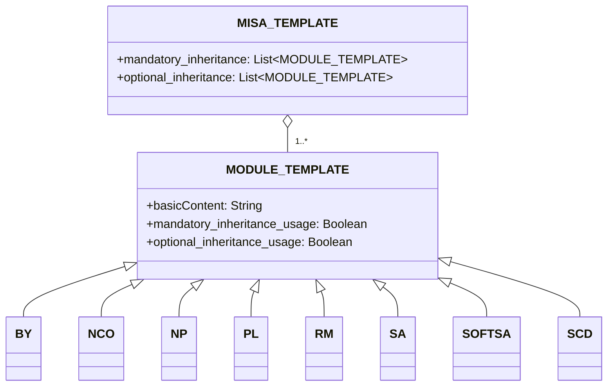

# 关于
Modular and Inclusive Software Advancement（MISA）许可证框架是一个根据您的需求轻松调整的许可证框架。框架本身在最新版本的[MISA-CLASSIC](/MISA-CLASSIC.md)许可证下获得许可。

该存储库名称的缩写版本"MISA-LF"也是一个可接受的变体，用于遵循许可证的"命名连续性义务"的基本名称。

MISA许可证框架旨在为开源许可提供灵活和模块化的方法。通过组合各种许可证模块，用户可以创建适合其特定需求和偏好的自定义许可证。

## 关于MISA-CLASSIC.md
需要注意的是，MISA-CLASSIC等同于MISA-NCO，后者是由命名连续性义务（NCO）模块组成的许可证。这意味着任何在MISA-CLASSIC下获得许可的项目也可以被视为在MISA-NCO下获得许可。

MISA-CLASSIC许可证为MISA许可证框架的开发奠定了基础，通过引入各种可定制的模块，扩展了模块化许可的概念，这些模块可以组合起来创建针对特定需求和偏好量身定制的许可证。

## 框架大纲
MISA许可证框架由以下组件组成：

1. MISA-CLASSIC.md：作为框架基础的基本许可证。
2. 模板：
   - MISA-TEMPLATE.md：用于创建新的基于MISA的许可证的模板。
   - MODULE-TEMPLATE.md：用于创建新的许可证模块的模板。
3. 默认模块：一组预定义的许可证模块，可用于基于MISA的许可证。

## 框架结构
MISA许可证框架的结构可以使用以下mermaid图进行可视化：

## 默认模块
MISA许可证框架附带以下默认模块：

- [BY.md](/Default%20modules/BY.md)：署名/信用
- [NCO.md](/Default%20modules/NCO.md)：命名连续性义务
- [NP.md](/Default%20modules/NP.md)：非盈利/非商业
- [PL.md](/Default%20modules/PL.md)：专利许可
- [RM.md](/Default%20modules/RM.md)：互惠/相互许可
- [SA.md](/Default%20modules/SA.md)：Copyleft/相同方式共享
- [SOFTSA.md](/Default%20modules/SOFTSA.md): 软件著佐权/相同方式共享 (仅针对复刻版本)
- [SCD.md](/Default%20modules/SCD.md)：源代码披露

## 使用模板
### 创建新的基于MISA的许可证
要创建新的基于MISA的许可证，请按照以下步骤操作：

1. 将[MISA-TEMPLATE.md](/Templates/MISA-TEMPLATE.md)的内容复制到新文件中。
2. 根据您的要求修改章节和模块。
3. 使用适当的名称保存文件，遵循"命名约定"部分中描述的命名约定。

### 添加新的许可证模块
要添加新的许可证模块，请按照以下步骤操作：

1. 将[MODULE-TEMPLATE.md](/Templates/MODULE-TEMPLATE.md)的内容复制到新文件中。
2. 填写模块所需的信息和条件。
3. 使用适当的名称保存文件，遵循"命名约定"部分中描述的命名约定。
4. 将新模块添加到您的基于MISA的许可证的适当部分（第2节或第5节）。

## 命名约定
基于MISA的许可证的命名约定如下：

MISA-AA/BB/.../XX-aa/bb/.../xx-|xxx|

其中：
- AA/BB/.../XX代表强制继承条件，使用大写字母。
- aa/bb/.../xx代表可选继承条件，使用小写字母。
- |xxx|代表未被预定义模块涵盖的附加条件的简要描述，用管道字符（|）括起来。

例如，由以下默认模块组成的许可证：
- 强制：命名连续性义务（NCO）、源代码披露（SCD）
- 可选：署名/信用（BY）、专利许可（PL）

将被命名为：MISA-NCO/SCD-by/pl

另一个例子，具有以下条件的许可证：
- 强制：Copyleft/相同方式共享（SA）、非盈利/非商业（NP）、互惠/相互许可（RM）
- 附加条件："不得用于军事目的"

将被命名为：MISA-SA/NP/RM-|Not for military use|

对于许可证模块，命名约定如下：

ModuleName (Abbreviation)

其中：
- ModuleName是模块的全名。
- Abbreviation是模块名称的缩写形式，用括号括起来。

## 关于法律术语的说明

请注意，本存储库的内容，包括MISA许可证框架、默认模块和模板，主要是使用大型语言模型（LLM）生成的。虽然我们已尽一切努力确保此处提供的信息准确无误且清晰易懂，但在某些情况下，所使用的法律术语可能不够精确或全面。

我们非常鼓励并欢迎法律专家和知识渊博的个人提交拉取请求，以帮助我们完善和改进整个存储库中使用的法律语言。您的贡献将对确保MISA许可证框架在法律上合理且可在实际场景中有效使用至关重要。

如果您发现任何法律不准确之处、措辞不清晰或有改进建议，请随时提交包含您建议更改的拉取请求。让我们共同努力，将MISA许可证框架打造成一个强大可靠的开源社区工具。

感谢您在这一共同努力中的理解和支持，以创建一个在法律上准确且全面的模块化许可框架。