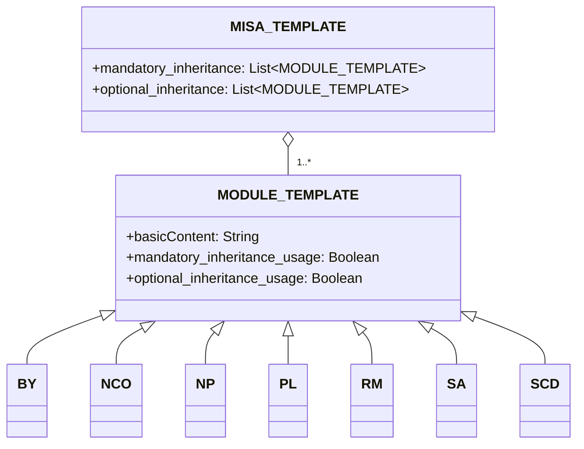

# About
Modular and Inclusive Software Advancement (MISA) License framework is a license framework that is easily adjustable based on your demands. The framework itself is licensed under the latest version of [MISA-CLASSIC](/MISA-CLASSIC.md) license.

"MISA-LF", the abbreviated version of this repository name, is also an acceptable variant for the base name to follow the "Naming Continuity Obligation" of the license.

The MISA License framework is designed to provide a flexible and modular approach to open source licensing. By combining various license modules, users can create custom licenses that suit their specific needs and preferences.

## About MISA-CLASSIC.md
It's important to note that MISA-CLASSIC is equivalent to MISA-NCO, which is a license composed of the Naming Continuity Obligation (NCO) module. This means that any project licensed under MISA-CLASSIC can also be referred to as being licensed under MISA-NCO.

The MISA-CLASSIC license laid the groundwork for the development of the MISA License framework, which expands upon the concept of modular licensing by introducing a wide range of customizable modules that can be combined to create licenses tailored to specific needs and preferences.

## Framework Outline
The MISA License framework consists of the following components:

1. MISA-CLASSIC.md: The base license that serves as the foundation for the framework.
2. Templates: 
   - MISA-TEMPLATE.md: A template for creating new MISA-based licenses.
   - MODULE-TEMPLATE.md: A template for creating new license modules.
3. Default Modules: A collection of pre-defined license modules that can be used in MISA-based licenses.

## Framework Structure
The structure of the MISA License framework can be visualized using the following mermaid diagram:

## Default Modules
The MISA License framework comes with the following default modules:

- [BY.md](/Default%20modules/BY.md): Attribution/Credit
- [NCO.md](/Default%20modules/NCO.md): Naming Continuity Obligation
- [NP.md](/Default%20modules/NP.md): Non-Profit/Non-Commercial
- [PL.md](/Default%20modules/PL.md): Patent License
- [RM.md](/Default%20modules/RM.md): Reciprocity/Mutual Licensing
- [SA.md](/Default%20modules/SA.md): Copyleft/Share-Alike
- [SCD.md](/Default%20modules/SCD.md): Source Code Disclosure

## Using the Templates
### Creating a New MISA-based License
To create a new MISA-based license, follow these steps:

1. Copy the contents of [MISA-TEMPLATE.md](/Templates/MISA-TEMPLATE.md) into a new file.
2. Modify the sections and modules according to your requirements.
3. Save the file with an appropriate name, following the naming convention described in the "Naming Convention" section.

### Adding a New License Module
To add a new license module, follow these steps:

1. Copy the contents of [MODULE-TEMPLATE.md](/Templates/MODULE-TEMPLATE.md) into a new file.
2. Fill in the necessary information and conditions for the module.
3. Save the file with an appropriate name, following the naming convention described in the "Naming Convention" section.
4. Add the new module to the appropriate section (Section 2 or Section 5) of your MISA-based license.

## Naming Convention
The naming convention for MISA-based licenses is as follows:

MISA-AA/BB/.../XX-aa/bb/.../xx-|xxx|

Where:
- AA/BB/.../XX represent the mandatory inheritance conditions, using uppercase letters.
- aa/bb/.../xx represent the optional inheritance conditions, using lowercase letters.
- |xxx| represents a brief description of the additional conditions not covered by the predefined modules, enclosed in pipe characters (|).

For example, a license composed of the following default modules:
- Mandatory: Naming Continuity Obligation (NCO), Source Code Disclosure (SCD)
- Optional: Attribution/Credit (BY), Patent License (PL)

Would be named: MISA-NCO/SCD-by/pl

Another example, a license with:
- Mandatory: Copyleft/Share-Alike (SA), Non-Profit/Non-Commercial (NP), Reciprocity/Mutual Licensing (RM)
- Additional conditions: "Not for military use"

Would be named: MISA-SA/NP/RM-|Not for military use|

For license modules, the naming convention is:

ModuleName (Abbreviation)

Where:
- ModuleName is the full name of the module.
- Abbreviation is a short form of the module name, enclosed in parentheses.

## Note on Legal Terminology

Please note that the content of this repository, including the MISA License framework, the default modules, and the templates, was primarily generated using Large Language Models (LLMs). While we have made every effort to ensure the accuracy and clarity of the information presented here, there may be instances where the legal terminology used is not precisely correct or comprehensive.

We highly encourage and welcome pull requests from legal experts and knowledgeable individuals to help us refine and improve the legal language used throughout this repository. Your contributions will be invaluable in ensuring that the MISA License framework is legally sound and can be effectively used in real-world scenarios.

If you notice any legal inaccuracies, unclear wording, or have suggestions for improvement, please don't hesitate to submit a pull request with your proposed changes. Together, we can work towards making the MISA License framework a robust and reliable tool for the open-source community.

Thank you for your understanding and support in this collaborative effort to create a legally precise and comprehensive modular licensing framework.